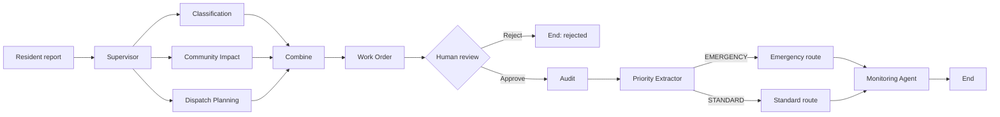
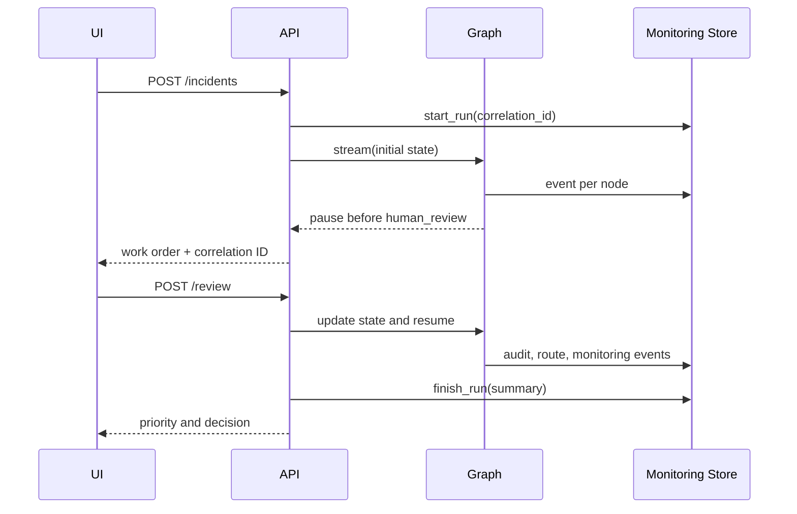

# Technical Architecture

## Design goals

The system mirrors the reference project's engineering patterns while keeping the implementation small: explicit shared state, parallel specialists, human control, conditional routing, run-level monitoring, a web/API surface, and one deployable container.

The equivalent exchangeable process definition is `civic_incident_coordinator.bpmn`.

## Components

| Component | Role |
|---|---|
| `app/graph.py` | Prompts, nodes, LangGraph topology, MemorySaver checkpoint, workflow services |
| `app/monitoring.py` | UUIDs, per-node telemetry, SQLite/memory storage, aggregation |
| `app/api.py` | Request validation, REST endpoints, liveness probe |
| `app/web.py` | Dependency-free operations UI and monitoring dashboard |
| SQLite | Durable monitoring traces when its filesystem is persistent |
| MemorySaver | Short-lived human-review checkpoint within one process |

## State and execution

`IncidentState` is the run contract. Three specialist results use `Annotated` reducers so parallel branches can safely converge. The graph pauses with `interrupt_before=["human_review"]`. The review endpoint updates checkpoint state; approval resumes at `human_review`, while rejection closes monitoring without running downstream nodes.

The supervisor can disable irrelevant specialists. Disabled nodes return a structured `not_requested` result, preserving the join topology. Priority extraction recognizes only `EMERGENCY`; all other content becomes `STANDARD`, avoiding accidental emergency escalation from malformed output. The human operator still controls whether routing occurs at all.

## Observability

`start_incident` creates one UUID before graph execution. The `@monitored` decorator reads it from state and records node name, success/error, duration, model token usage, and UTC timestamp. The monitoring agent checks the completed pre-route trace. A run ends as `completed`, `rejected`, or `failed`.

## Deployment model

One Uvicorn process listens on Railway's injected `PORT`. The container runs as an unprivileged user. `/health` does not initialize the LLM or read/write the database. Docker Compose supplies a named volume locally; Railway persistence requires an optional `/app/data` volume.

## Security and privacy

Secrets are environment-only. Input length is bounded. Error details are truncated. HTML values on the server-rendered dashboard are escaped and UI model text is assigned through `textContent`. This demonstration does not include authentication; production exposure requires OIDC/RBAC, TLS at the platform edge, rate limiting, retention rules, and a privacy review.

## Design decisions

- SQLite instead of an external database keeps the MVP free and operationally small.
- No queue is used because execution is synchronous and free-tier capacity is intentionally low.
- No vector store is used because retrieval is not a requirement.
- The UI remains server-hosted and dependency-free, matching the reference FastAPI/HTML experience.
- The exact assignment model ID is fixed, even though it is retired, to avoid concealing non-compliance.
